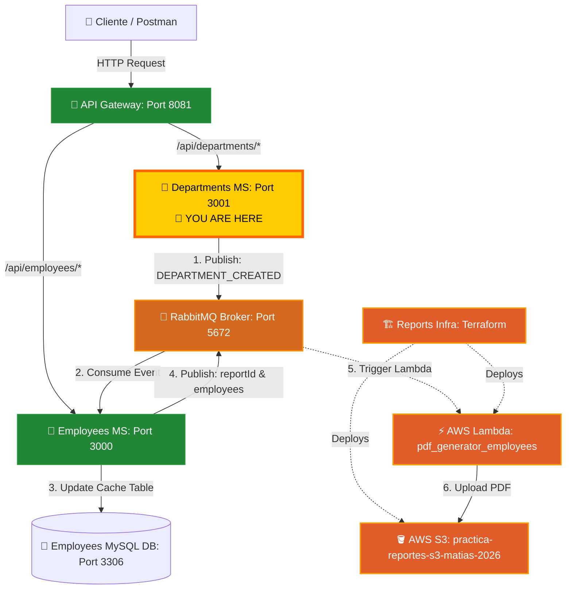

# 🏢 Departments Microservice (departments_ms)

<p align="center">
  
  
  
  
  
  
</p>

---

## 📌 Overview

This is a modern, high-performance, and lightweight **Departments Microservice** built with **Express 5**, **TypeScript 6**, and **MySQL 2**. It forms a core component of a practice microservices architecture (`microservicio_practice`) alongside an API Gateway and an Employees Microservice. It exposes endpoints to query and manage department data from the classic MySQL `employees` database.

Key architectural benefits include:
*   **Clean Architecture Pattern:** Strict separation of concerns across Routers, Controllers, Services, and Repositories.
*   **Decoupled Sync via RabbitMQ (New Feature):** When a department is registered here, it broadcasts a notification event so other services can update their local caches asynchronously.
*   **Strict Environment Configuration:** Validated at startup using **Zod** to prevent runtime crashes from missing environment keys.
*   **Modern TypeScript Runtime:** Uses `tsx` for rapid development reload loops and compiles native ES modules using `tsc`.
*   **Database Connection Pooling:** Managed securely with `mysql2/promise` connection pools.

---

## 🔗 Connected Repositories

This project is part of a larger microservices ecosystem. For a complete local testing environment, clone and run the other repositories:

*   **API Gateway:** [employees_api_gateway](https://github.com/MNATorres/employees_api_gateway.git)
*   **Departments Microservice (This repo):** [departments_ms](https://github.com/MNATorres/departments_ms.git)
*   **Employees Microservice:** [typescript-exercises](https://github.com/MNATorres/typescript-exercises.git)
*   **PDF Generator (AWS Lambda):** [pdf_generator_employees](https://github.com/MNATorres/pdf_generator_employees.git)
*   **Reports Infrastructure (Terraform):** [reports_infra_ms](https://github.com/MNATorres/reports_infra_ms.git)

---

## 🏗️ System Architecture & Message Flow

The architecture consists of several microservices cooperating over synchronous proxy requests, asynchronous RabbitMQ event streaming, and serverless PDF generation in the cloud.



---

## ⚙️ Tech Stack & Key Libraries

| Technology | Version | Description |
| :--- | :--- | :--- |
| **Node.js** | `>= 20` | JavaScript Runtime Environment |
| **Express** | `^5.2.1` | Next-generation web framework with native promise handling |
| **TypeScript**| `^6.0.3` | Strongly-typed programming language |
| **Zod** | `^4.4.3` | Type-safe schema validation for environment variables |
| **MySQL2** | `^3.22.3`| Promise-based MySQL client with connection pooling |
| **amqplib** | `^2.0.1` | Node.js RabbitMQ client library for AMQP protocol |
| **tsx** | `^4.22.1`| TypeScript Execute (superfast alternative to ts-node) |

---

## 📂 Project Structure

```text
departments_ms/
├── src/
│   ├── config/              # Application, Database, & Queue configurations
│   │   ├── database.ts      # MySQL Pool and Health connection check
│   │   ├── env.ts           # Environment schema parsing & validation via Zod
│   │   └── queue.ts         # RabbitMQ publisher configuration
│   ├── controllers/         # Express Request/Response handlers
│   │   ├── departments.controller.ts
│   │   └── health.controller.ts
│   ├── repository/          # Data Access Layer (RAW SQL queries)
│   │   ├── base.repository.ts # Abstract CRUD / Query base structure
│   │   └── departments.repository.ts
│   ├── routes/              # Express Router definitions
│   │   ├── departments.router.ts
│   │   ├── health.router.ts
│   │   └── index.ts
│   ├── services/            # Business Logic Layer
│   │   └── departments.service.ts
│   ├── types/               # TypeScript models & interfaces
│   │   └── entities.type.ts
│   └── index.ts             # Microservice Bootstrap entrypoint
├── docker/                  # Init SQL dumps for container spin-up
├── .env                     # Local Environment Configurations
├── tsconfig.json            # TypeScript Compiler Configuration
├── docker-compose.yml       # MySQL and phpMyAdmin containers
└── package.json             # Scripts and Dependencies
```

---

## 🛡️ Database Integration

The service is integrated with the `departments` table in the database schema:

```sql
CREATE TABLE IF NOT EXISTS departments (
    dept_no CHAR(4) PRIMARY KEY,
    dept_name VARCHAR(40) UNIQUE NOT NULL
);
```

On bootstrap, the microservice runs a query validation (`SELECT 1`) to ensure the database connectivity is active before binding the port.

---

## 🚦 API Endpoints

All application routes are prefixed with `/api`.

### 🩺 Health Checks
*   **`GET /`**
    *   **Description:** Basic greeting check.
    *   **Response:** `200 OK`
    *   **Body:** `"bienvenidos a departments api"`
*   **`GET /api/health`**
    *   **Description:** Active service health status.
    *   **Response:** `200 OK`
    *   **Body:**
        ```json
        {
          "status": "UP",
          "timestamp": "2026-05-23T17:16:00.000Z",
          "message": "Respuesta generada desde el controlador de health"
        }
        ```

### 🏢 Departments Management
*   **`GET /api/departments`**
    *   **Description:** Retrieves all registered departments.
    *   **Response:** `200 OK`
    *   **Body:**
        ```json
        {
          "message": "Respuesta generada desde el servicio de departamentos",
          "data": [
            { "dept_no": "d001", "dept_name": "Marketing" },
            { "dept_no": "d002", "dept_name": "Finance" }
          ]
        }
        ```
*   **`POST /api/departments/by-number`**
    *   **Description:** Find a specific department by its department number code.
    *   **Request Body:**
        ```json
        {
          "number": "d001"
        }
        ```
    *   **Response:** `200 OK`
    *   **Body:**
        ```json
        {
          "message": "Response for d001 from departments.service",
          "data": [
            { "dept_no": "d001", "dept_name": "Marketing" }
          ]
        }
        ```
*   **`POST /api/departments/create` (New Feature)**
    *   **Description:** Creates a new department in the database and publishes a synchronization event to RabbitMQ.
    *   **Request Body:**
        ```json
        {
          "dept_no": "d999",
          "dept_name": "R&D"
        }
        ```
    *   **Response:** `201 Created`
    *   **Body:**
        ```json
        {
          "message": "Departamento creado con éxito y evento notificado.",
          "data": {
            "dept_no": "d999",
            "dept_name": "R&D"
          }
        }
        ```

---

## 🚀 Getting Started & Local Testing

To test this service in integration with the RabbitMQ broker and the Employees cache consumer, **all three projects must be running.**

### 1. Prerequisites
*   **Node.js** (v20 or higher)
*   **Docker & Docker Compose**

### 2. Docker Containers Setup
Before running the server, start the databases and the message broker:
1.  **In this project folder (`departments_ms`):** Run the MySQL database (mapping external port `3307` to internal `3306`) and phpMyAdmin:
    ```bash
    docker compose up -d
    ```
    *Access phpMyAdmin at [http://localhost:8082](http://localhost:8082)*
2.  **In the `api_gateway` folder:** Run the RabbitMQ broker:
    ```bash
    docker compose up -d
    ```
3.  **In the `typescript-exercises` / `employes_ms` folder:** Run the Employees MySQL database:
    ```bash
    docker compose up -d
    ```

### 3. Environment Configuration
Create a `.env` file in the root directory (or edit the existing one):
```env
PORT=3001
DB_HOST=localhost
DB_PORT=3307
DB_USER=root
DB_PASSWORD=password
DB_DATABASE=departments
```

### 4. Installation & Development Launch
Install the project dependencies and boot up the server:
```bash
npm install
npm run dev
```
*Starts the compiler runtime in watch mode using `tsx`.*

### 5. Verify RabbitMQ Event Publishing
When the service successfully connects to RabbitMQ on startup, you will see this log:
`🐇 Connected to RabbitMQ successfully. Queue ready: departments_events`

Send a `POST` request to `http://localhost:3001/api/departments/create` to register a department. You should see:
`📣 Event published to queue [departments_events]: DEPARTMENT_CREATED`

---

## 🤝 Contribution & License
This project is licensed under the **ISC License**. Developed by Matias Torres for modern microservices practice.
